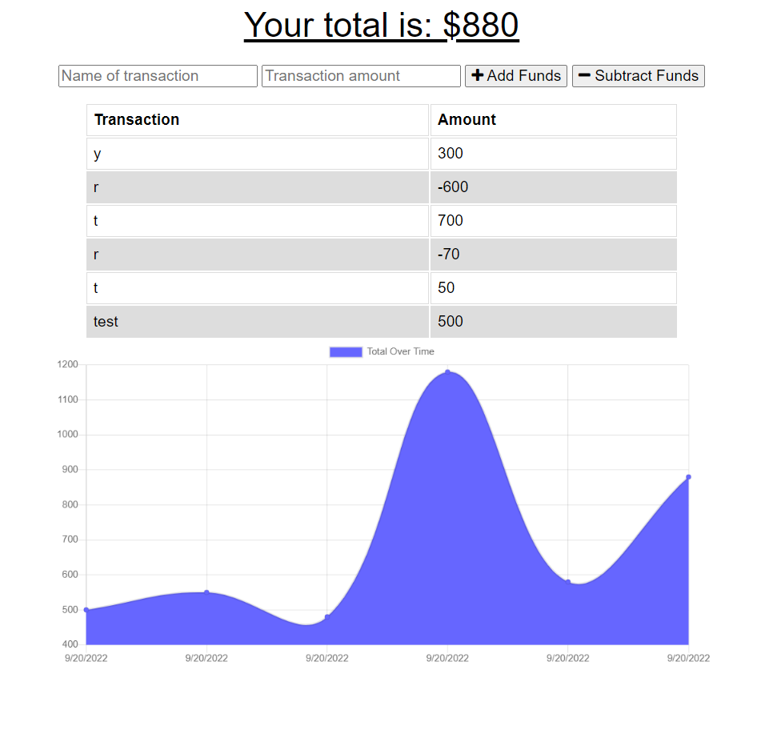

# budget-tracker

## About
This application is a progressive web app that saves user inputs to track a budget. It has both online and offline functionality. Technologies used include MongoDB, IndexedDB, and service workers. 

## Application

## Links
- [GitHub Repo](https://github.com/josie-franklin/budget-tracker)
- [Deployed Page](https://glacial-meadow-01836.herokuapp.com/)